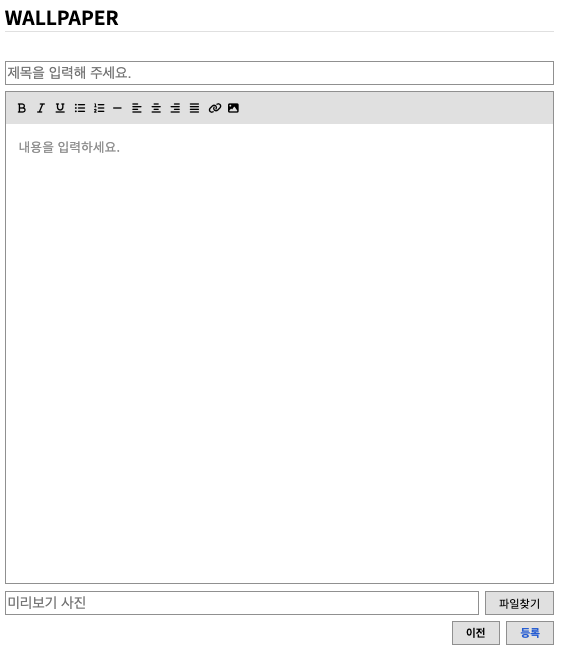

# 🐥 TotalOri 개인 홈페이지 제작 프로젝트

<!-- 서비스 소개 (서비스 설명, 링크, 개발 언어) -->
## ✅ 서비스 소개

### 서비스 설명
* 캐릭터 디자이너를 위한 개인 홈페이지
* 배경화면 공유, contact 정보 게시

### 링크
* https://totalori.netlify.app

### 개발 배경
* 캐릭터 배경화면 이미지를 공유하기 위한 웹페이지 필요
* 광고 혹은 협업 문의를 위한 Contact 정보 개시 필요

### 사용기술
* Client -   
* Server - 
* Deploy - 

#
<!-- 주요 기능 (로그인, 게시글 등등..) -->
## ✅ 주요 기능
## 1. admin 기능

**기능 요약**

- 로그인에 성공한 user는 admin이며 게시판 관리, 메인페이지 사진 변경, 소개 글 변경 진행 가능

**기능 상세**

- 일반 User 들은 로그인 없이 모든 서비스 이용 가능
- 로그인은 admin을 인증하기 위한 수단
    - 로그인 페이지 URL 과 아이디, 비밀번호는 관리자에게만 제공
- 로그인한 admin만 게시판 관리, 메인페이지 사진 변경, 소개 글 변경 가능한 페이지 혹은 버튼이 보이도록 설정

**구현 방식**

- ‘Firebase’의 ‘Authentication’ 서비스를 사용하여 로그인 정보 일치하는지 여부 확인
- 일치한다면 cookie에 사용자 UID 를 저장
    - cookie의 유효기간은 30일로 지정

사진 자료

- 로그인한 admin만 아래와 같이 admin 메뉴가 보임
    
    
    
- 메인페이지 사진 변경, 소개글 변경을 진행할 수 있음
    
    
    

## 2. 배경화면 공유 게시판

**기능 요약**

- 사람들이 캐릭터 관련 배경화면 사진을 다운 받을 수 있는 게시판

**기능 상세**

- 일반 User
    - 배경화면 공유 게시판에서 글을 확인하고 게시 글을 클릭 시 상세 게시글로 이동
    - 원하는 배경을 우클릭을 통해 다운로드
    - 상세 게시글 하단에 이전, 다음 게시 글 이동 가능한 링크 표시
- Admin
    - 배경화면 공유 게시판에서 ‘게시글 작성’ 버튼 활성화
    - 배경화면 상세 페이지에서 ‘수정’, ‘삭제’ 버튼 활성화

**사진 자료**

- 일반 User가 게시판에 들어간 경우
    
    
    
- 일반 User가 상세 게시글로 들어간 경우
    
    
    
- 상세 게시글 하단의 이전, 다음 게시글 이동 가능한 링크
    
    
    
- Admin이 게시판에 들어간 경우 ‘글쓰기’ 버튼
    
    
    
- Admin이 게시글 작성에 들어간 경우
    
    

#
## ✅ Troubleshooting

## 1. Firebase 환경변수 설정 문제

**문제점**

- Firebase에 연결하기 위한 config 정보가 필요한데 Backend 서버가 따로 없어서 숨길 방법이 없음

**해결방법**

- Front 서버로는 숨길 방법이 없어 임시방편으로 Github에는 해당 config 정보를 올리진 않지만 Netlify에서 build 시에 환경변수 파일을 생성하도록 command 작성
    
    
    
- 근본적인 해결은 되지 않지만 config 정보에 대한 보안 위험성은  Firebase에서 ‘Firestore Database’ 접근에 대한 규칙을 지정하여 보안을 어느 정도 높일 예정

#
## ✅ 개선 예정 사항

## 1. Wallpaper 게시글 수가 많아질 경우

**문제점**

- 현재 paging 처리를 진행하지 않았기 때문에 게시글 수가 많아진다면 loading 하는데 많은 시간이 걸릴 것이고 사용자에게도 불편을 초래
- paging 처리 혹은 infinite scroll 처리 진행 예정